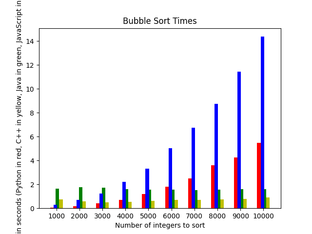
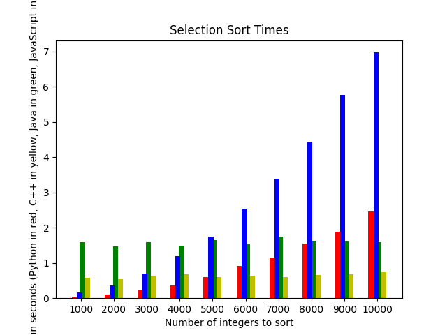
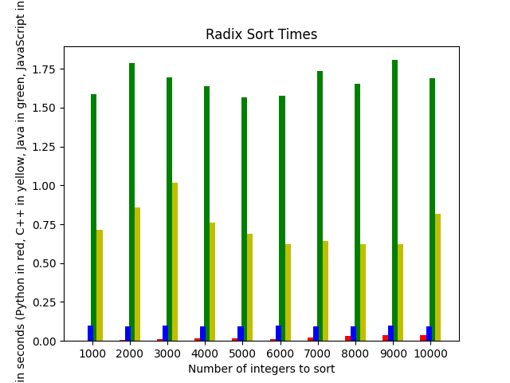

# James Neisen Module 3 Open Ended Project

## Added Installations Needed
To Run this program I needed to install Node.js and add it to my PATH variable so I could use JavaScript, otherwise it just uses Python, C++, and Java which I already had installed and set up for other assignments this unit and other classes.

## Summary of the Program
This program builds off of the Speed Test guided project from this unit by adding two new programming languages and two other sorting algorithms. Each of the four languages I used, Python, C++, Java, and JavaScript have each of the three sorting algorithms (Bubble Sort, Selection Sort, and Radix Sort). Most of the code is in the Main.py file which handles the time calculations, calls the command line to compile if needed, and to run the sorting algorithms for each language, and then uses matplotlib to graph them (there is one graph per sorting algorithm to compare the runtimes.)

The program starts in python.

## Analyis of Data

For the bubble sort runtimes, we can see that the two interpreted languages (Python and JavaScript) are far slower than the compiled languages, because some of the runtime is used to interpret the code, which for C++ and Java, the compiler has already done. Javascript is considerably slower here, which may be in part because this was my first time working with JavaScript and my code might not be the most efficient/as efficient as my code is for the other languages. Regardless it does seem to be significantly slower than the other three languages used, which is likely because it has been developed with less of a focus on speed and efficiency than other languages used here (especially C++). Python, also being interpreted is pretty slow as we saw in the Speed Test project. Java is faster than the interpreted languages, but is still quite a bit slower than C++, which makes sense, especially considering the focus on speed and efficiency that C++ has. Bubble sort is a O(N^2) algorithm, and even within other O(N^2) algorithms it is especially slow, so it shows off the differences between the languages well. 

The data for the selection sort is similar, with less pronounced differences between the different languages, but the radix sort data shows an interesting pattern. The compiled languages are quite a bit slower in this case, likely because of the time it takes to compile the program into an executable. Because Radix sort is only O(N), the compilation time plays a bigger role in the differences in time here. All four of the languages can do radix sort fairly quickly, and we don't see much a difference between the different array sizes.

## Module 3 Concepts Used
- Programming Language: Python
- Programming Language: C++
- Programming Language: Java
- Programming Language: JavaScript
- Command Line Arguments and File I/O for each language (except python)

## Known Bugs
I don't believe there are any bugs currently in the program

## Future Work
This project could very easily have potential for future work, it would not be difficult to add more languages, or more algorithms. I think it would be interesting to use one of the sorting algorithms that uses recursion, like merge sort or quick sort, and see how the times compare for recursion among the languages. 

## Sources Used
- Help with radix sort implementation: https://www.geeksforgeeks.org/radix-sort/
- Getting python to open a java file: https://stackoverflow.com/questions/9333637/how-to-execute-java-program-using-python-considering-inputs-and-outputs-both
- Java command line arguments: https://docs.oracle.com/javase/tutorial/essential/environment/cmdLineArgs.html
- JavaScript stuff (how to get data from a file and use command line arguments mostly): 
    - https://www.boardinfinity.com/blog/how-to-run-a-js-file-in-terminal/
    - https://www.geeksforgeeks.org/how-to-read-command-line-arguments-in-node-js/
    - https://nodejs.org/api/fs.html#fs_fs_readfile_path_options_callback
    - https://www.geeksforgeeks.org/node-js-fs-readfile-method/
    - https://sentry.io/answers/how-to-insert-an-item-into-an-array-at-a-specific-index-using-javascript/#:~:text=Using%20the%20splice()%20Method,method%20modifies%20the%20original%20array.&text=The%20first%20argument%20of%20the,is%20the%20only%20required%20argument.
    - https://www.w3schools.com/python/ref_file_readlines.asp#:~:text=The%20readlines()%20method%20returns,file%20as%20a%20list%20item.
    - https://www.geeksforgeeks.org/how-to-return-an-array-from-async-function-in-node-js/
    
## Grade Earned
I think I deserve somewhere around 80-90 points, my main program is pretty complex and uses the command line stuff to call the other files. It is not particularily interactive though, just by virtue of what the project is, it didn't really make sense to ask the user for input. I used 3 other programming languages aside from C++ which I think is used in a robust way that makes sense for the program. I did not use any other programming languages. I also did all of the things that are expected and can result in a loss of points. So I would give myself like 20 points for the main program and then 20 for each of the non-C++ languages (Python, Java, and JavaScript) resulting in 80ish points plus a few points for the command line arguments and file I/O for each language. 
